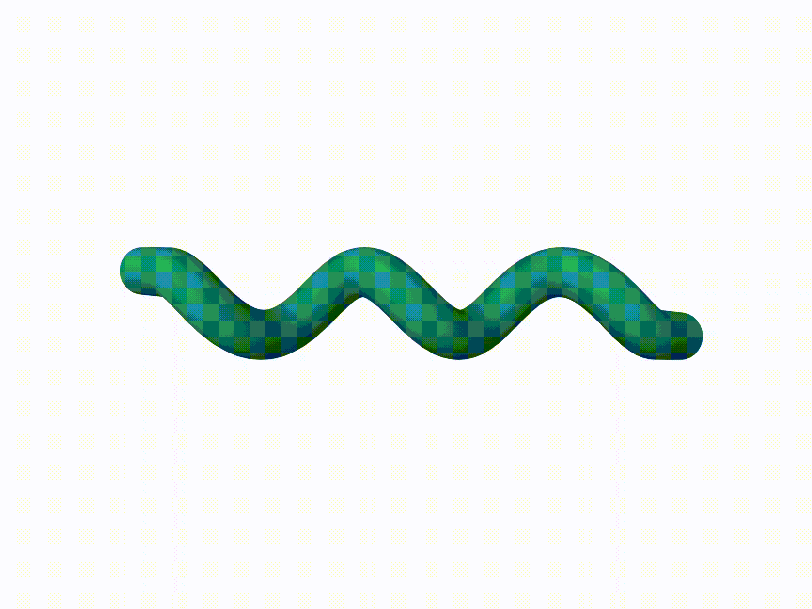

# RNA 3D structure: Reading and writing PDB files with BioPython and Plotly

This repository contains the code for the article "RNA 3D structure: Reading and writing PDB files with BioPython and Plotly".

4XW7 |     Helix structure     
:-------------------------:|:-----------------------:
 |  | 

This article is available at [Medium](). 


## Installation

You just need to download `biopython` and `plotly` using:

```bash
pip install biopython plotly
```

## Usage

To run the code for the visualisation of a `.pdb` file, you can use the following command:

```bash
python src/read_pdb.py
```

To run the code for writing a `.pdb` file, you can use:

```bash
python src/write_pdb.py
```


