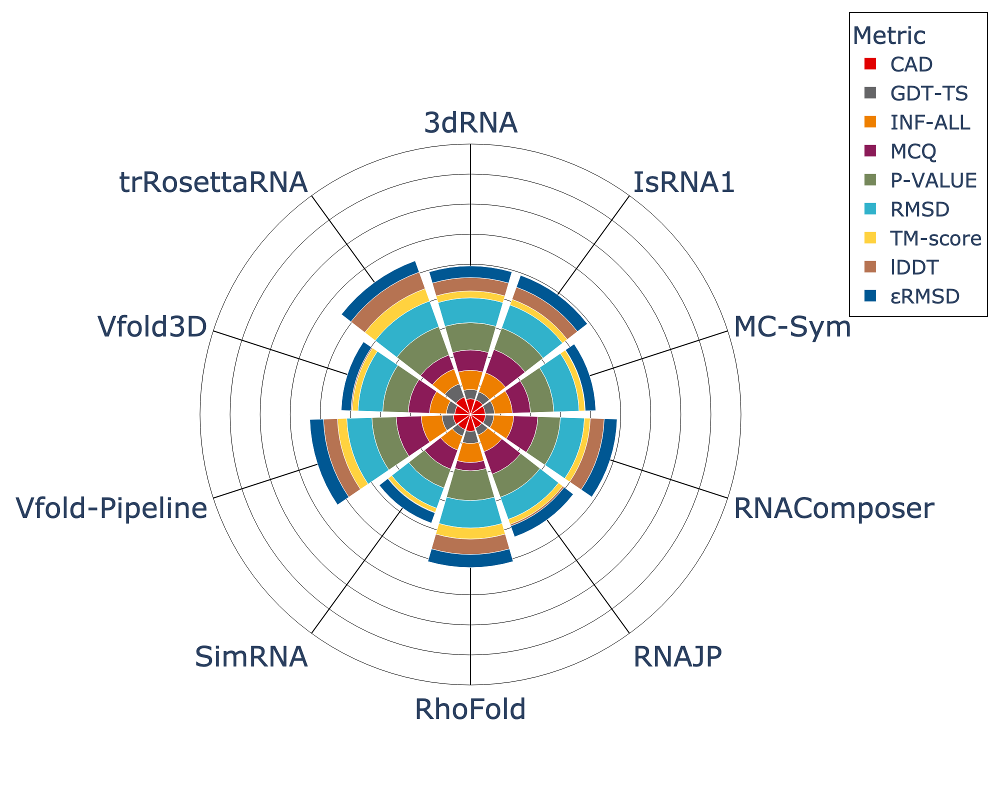

# State-of-the-RNArt: benchmarking current methods for predicting RNA 3D structures

This repository contains the code discussed in the Medium article : "State-of-the-RNArt: benchmarking current methods for predicting RNA 3D structures".


## Installation

If you want to run the `RNAdvisor` tool to get the results of the benchmark, you can download the `RNAdvisor` docker image using:

```bash
git pull sayby77/rnadvisor:latest
```

To install the libraries needed for the visualisation, you just need to install `plotly` and `sklearn` using:
```bash
pip install plotly scikit-learn
```

## Data

The data is available in the `data` folder.

It is composed of two folders: `input` and `output`.

In the `input` folder, there are the native structure (in `data/input/NATIVE`) and the predictions from the different methods (in `data/input/PREDS`).


## Commands

To run the benchmark and compute the different structural metrics, you can use the following command:

```bash
python -m src.score_computation
```

If you do not want to run again the metrics computation, just run the visualisation command, as the outputs from the metrics computation are already saved in the `data/output` folder.


To run the visualisation, you can use the following command:

```bash
python -m src.polar_chart
```

It will output and save the polar chart in `polar_plot.png`:


